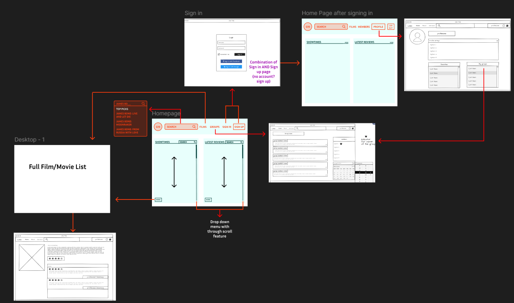
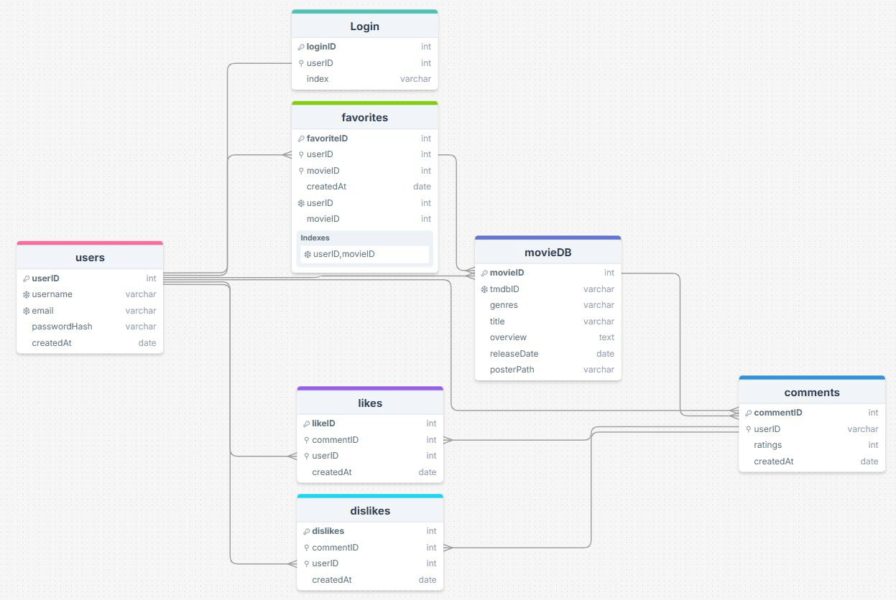
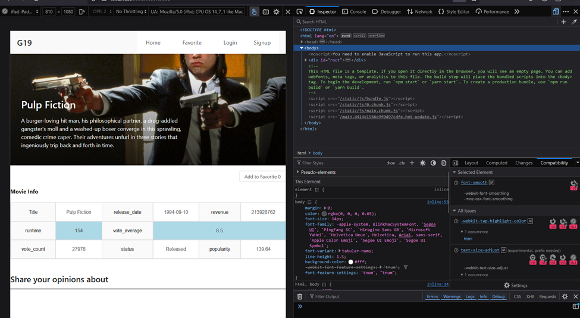
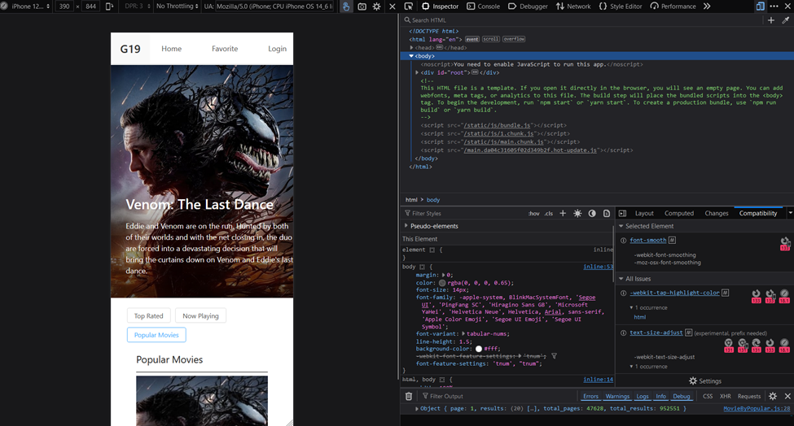
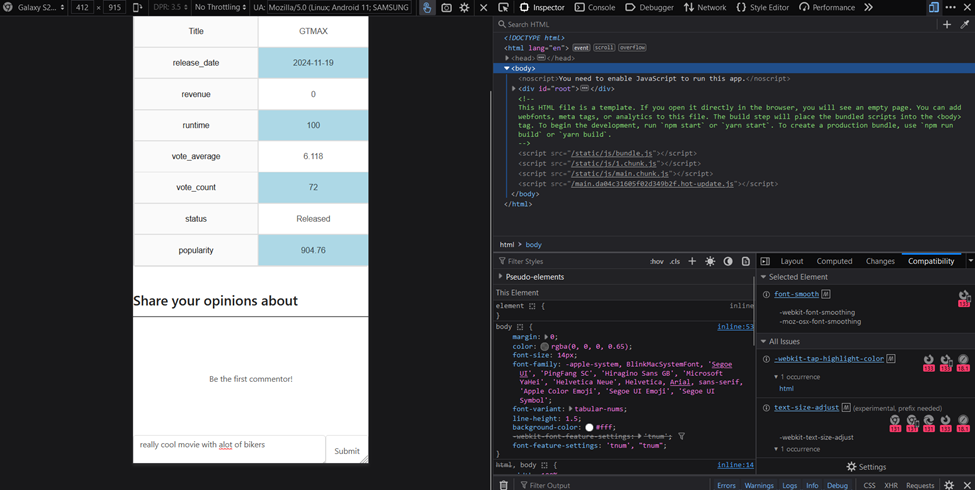

#Group 19 Movie App

About
This is a movie application built by 2 information technology students. This project was made with JavaScript, HTML, React.js, and MongoDB that allows users to search for movies, view movie details, check showtimes, and interact with movie reviews. 

#Technologies:
-	Javascript, Express JS, MongoDB, NodeJS
-	React, React-Rout
-	Source Data:
        o	The app fetches movie data from the [TMDB Movie Database API], which provides information such as movie titles, descriptions, showtimes and casts.
#Features:
    #Search for Movies
        Allows users to search for movies by title. The search bar queries the TMDB movie database API to display relevant results.
    #Movie List
        Displays a grid list of movies fetched from the TMDB API, providing users with a quick overview of popular or recently released films.
    #Movie Showtimes
        Shows available showtimes for each movie, allowing users to check when and where they can watch the movie in theaters. This is done using Finnkino Showtimes XML to display accurate and up-to-date movie screening times and locations.
    #Comment Reviews
        Users can post comments (reviews and personal thoughts) for movies they have seen. These reviews are stored in MongoDB and can be accessed by other users for feedback.
    #Like/Dislike 
        Users can interact with comments by liking or disliking them. This helps highlight popular or helpful reviews for the community.
    #Movie Casts
        Displays the cast and crew of each movie, giving users details about the actors and directors involved in the film. Casts are taken from the TMDB API.

#Running the App
1.	Set Up MongoDB:
Create your own MongoDB database. In the ‘config’ folder in the server folder, create a dev.js file and add your database connection information.
2.	Dependencies:
Run npm install in the client and server directories to install the required packages.
3.	Node.js Version Warning:
The app works with Node.js LTS versions. Ensure your Node.js version is compatible with the current Long-Term Support (LTS) release.
4.	Start the Frontend:
From the client directory: npm run start
5.	Start the Backend:
From the server directory: npm run backend
6.	Access the App:
o	The frontend runs in development mode at http://localhost:3000.
o	The backend API is served at the appropriate endpoint based on your configuration.

UI Initial Design

Class Diagram Describing Database Structure

Description of Links:
1.	Users → Favorites:
        o	Link: users.userID → favorites.userID
        o	How it Works: A user can mark multiple movies as favorites. The favorites table links a specific user (via userID) to a specific movie (via movieID).
2.	movieDB → Favorites:
        o	Link: movieDB.movieID → favorites.movieID
        o	How it Works: The favorites table connects a movie in the movieDB table to the user who marked it as a favorite. This forms a many-to-many (N:N) relationship between users and movies.
3.	Users → Comments:
        o	Link: users.userID → comments.userID
        o	How it Works: A user can post multiple comments about different movies. Each comment links back to the user who posted it.
4.	movieDB → Comments:
        o	Link: movieDB.movieID → comments.movieID
        o	How it Works: A comment is associated with a specific movie in the movieDB. This allows users to review or discuss individual movies.
5.	Users → Likes/Dislikes:
        o	Link: users.userID → likes.userID / dislikes.userID
        o	How it Works: A user can like or dislike comments made by other users. Each like or dislike is linked to a specific comment via commentID (or commentsID).
6.	Comments → Likes/Dislikes:
        o	Link: comments.commentID → likes.commentID / dislikes.commentID
        o	How it Works: Likes and dislikes are tied to specific comments, allowing tracking of feedback on individual user reviews.
7.	Login → Users:
        o	Link: users.userID → login.userID
        o	How it Works: The login table records user logins, linking each login record to a specific user.

App Responsiveness (The UI design had not yet been fully edited when this screenshot was taken.
Do not mind it being different in the video)
Example with iPad IOS

Example with iPhone12/13 IOS 

Example with Galaxy S20 Ultra Android 11
